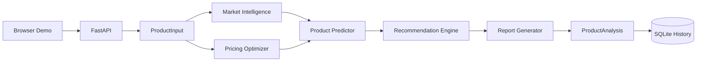

# Zenyeno AI Ecommerce Product Analysis Engine

[](https://github.com/zenyenochen-alt/zenyeno-ai-core/actions/workflows/ci.yml)
[](LICENSE)
[](https://www.python.org/)

Publicly available source code for transparent ecommerce product scoring, cost-aware pricing, market heuristics, sales recommendations, and report generation.

> **Noncommercial license:** permitted noncommercial use is allowed. Commercial use requires a separate written license from Zenyeno. See [License](#license) and the [Data Use Policy](DATA_USE_POLICY.md).

> **Project status:** v1.1 is a deterministic baseline with a browser demo, detailed cost inputs, private analysis history, API-key protection, rate limiting, Docker, and CI. It does not claim to use live marketplace data or an LLM yet.

## Features

- Strict FastAPI and Pydantic request/response contracts
- Unified product potential field: `final_score`
- Trend, demand, competition, and buyer-interest estimates
- Cost model for product cost, shipping, advertising, platform fees, tax, and return reserves
- Target-margin-aware price and profit calculation
- Competition-adjusted product scoring and launch/test/avoid recommendations
- SQLite analysis history with protected list, detail, and deletion APIs
- Optional `X-API-Key`, in-memory rate limiting, request IDs, CORS allowlist, and security headers
- Responsive browser demo at `/`
- Markdown reports, Docker, Compose, tests, and GitHub Actions CI

## Architecture



```text
.
|-- api/                 # FastAPI application and HTTP controls
|-- core/                # Pydantic models, controller, report renderer
|-- database/            # SQLite history adapter
|-- market/              # Market-signal heuristics
|-- prediction/          # Product-potential scoring
|-- pricing/             # Cost, price, profit, and margin calculation
|-- recommendation/      # Sales decisions and actions
|-- web/                 # Browser demo
|-- tests/               # Unit and API tests
|-- .github/workflows/   # Continuous integration
|-- Dockerfile
`-- docker-compose.yml
```

Modules exchange typed Pydantic objects, preventing schema drift such as the former `potential_score`/`final_score` mismatch.

## Quick start

Requirements: Python 3.10 or newer.

```bash
git clone https://github.com/zenyenochen-alt/zenyeno-ai-core.git
cd zenyeno-ai-core
python -m venv .venv
source .venv/bin/activate  # Windows: .venv\\Scripts\\activate
pip install -r requirements.txt
uvicorn api.server:app --reload
```

Open:

- Browser demo: <http://localhost:8000/>
- API documentation: <http://localhost:8000/docs>
- Health check: <http://localhost:8000/health>

## Configuration

Copy `.env.example` to `.env` and set only the values you need:

```dotenv
ZENYENO_API_KEY=replace-with-a-long-random-value
RATE_LIMIT_PER_MINUTE=60
CORS_ORIGINS=https://your-frontend.example
DATABASE_PATH=data/analyses.db
PERSIST_ANALYSES=false
OPENAI_API_KEY=
AUTOMATION_API_URL=https://your-private-worker.example
AUTOMATION_API_KEY=
```

- If `ZENYENO_API_KEY` is empty, `/analyze` remains available for public demos.
- History endpoints are always disabled until `ZENYENO_API_KEY` is configured.
- Public demo inputs are not persisted by default. Configure an API key or explicitly set `PERSIST_ANALYSES=true` to save analyses.
- The rate limiter is a single-process baseline. A multi-instance deployment should use a shared store such as Redis.
- `OPENAI_API_KEY` is reserved for the planned provider integration and is not used by v1.1.
- `AUTOMATION_API_URL` and `AUTOMATION_API_KEY` enable the optional server-to-server candidate import. The private key is never sent to the browser.

## API usage

Available analysis routes:

- `POST /analyze` analyzes a product only.
- `POST /analyze/import` analyzes a product and imports the result into the configured private candidate queue.

### Analyze a product

```bash
curl -X POST "http://localhost:8000/analyze" \\
  -H "Content-Type: application/json" \\
  -H "X-API-Key: replace-with-a-long-random-value" \\
  -d '{
    "name": "Foldable Storage Box",
    "category": "Home Storage",
    "cost": 5,
    "market": "TikTok Philippines",
    "currency": "USD",
    "shipping_cost": 2,
    "advertising_cost": 1,
    "platform_fee_percent": 6,
    "tax_percent": 0,
    "return_rate_percent": 5,
    "target_margin_percent": 25
  }'
```

All added financial fields have backward-compatible defaults. For meaningful results, supply costs and percentages from your own authorized business data.

The response contains:

- `final_score` and `recommendation`
- `market_analysis`
- a full `pricing` cost breakdown
- `sales_recommendations`
- a Markdown `report`

### Analysis history

History requires `ZENYENO_API_KEY` and the matching request header:

```bash
curl -H "X-API-Key: replace-with-a-long-random-value" http://localhost:8000/analyses
curl -H "X-API-Key: replace-with-a-long-random-value" http://localhost:8000/analyses/1
curl -X DELETE -H "X-API-Key: replace-with-a-long-random-value" http://localhost:8000/analyses/1
```

## Tests

```bash
pip install -r requirements-dev.txt
pytest -q
python -m compileall -q api core database market prediction pricing recommendation
```

## Docker

```bash
docker compose up --build
```

The application is available at <http://localhost:8000>. SQLite history is persisted in the ignored local `data/` directory. Stop the service with `docker compose down`.

## Model boundaries

The current market engine is a transparent heuristic, not a source of live TikTok Shop, Amazon, Shopee, or Google Trends data. Scores must be calibrated with authorized market and business outcomes before production decisions.

The profit result includes only the cost assumptions supplied in the request. It does not invent fees, taxes, shipping costs, advertising costs, or return rates.

## Roadmap

- **v1.2 - AI providers:** OpenAI/Claude/Gemini abstraction for titles, selling points, explanations, and video scripts
- **v1.3 - live intelligence:** authorized marketplace and trend connectors with source timestamps
- **v1.4 - production platform:** user accounts, PostgreSQL, Redis rate limiting, background jobs, and observability
- **Long term:** an AI Ecommerce Operating System spanning market scanning, prediction, sourcing, pricing, content, and operations

See [CHANGELOG.md](CHANGELOG.md) for released changes.

## Contributing

Issues and pull requests are welcome for noncommercial development. Contributions use the same PolyForm Noncommercial terms. Keep module boundaries typed, add tests for behavioral changes, and never commit API keys, production data, or `.env` files. Follow [SECURITY.md](SECURITY.md) when reporting sensitive issues.

## License

The current version is source-available under the [PolyForm Noncommercial License 1.0.0](LICENSE):

- permitted noncommercial study, research, experiments, and testing are allowed;
- commercial operation, paid services, resale, revenue-generating use, or anticipated commercial application requires a separate written license from Zenyeno;
- source access grants no permission to access, collect, extract, sell, or redistribute private or third-party data;
- authorized data use must comply with [DATA_USE_POLICY.md](DATA_USE_POLICY.md).

Historical versions previously released under MIT retain the rights already granted for those versions. See [LICENSE_HISTORY.md](LICENSE_HISTORY.md).
