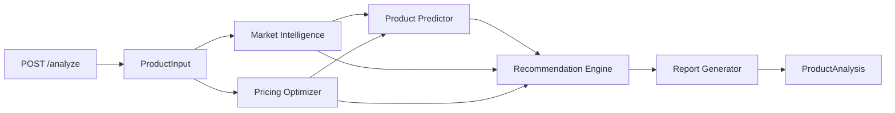

# Zenyeno AI Ecommerce Product Analysis Engine

[](https://github.com/zenyenochen-alt/zenyeno-ai-core/actions/workflows/ci.yml)
[](LICENSE)
[](https://www.python.org/)

AI-agent-style product research, potential scoring, pricing optimization, sales recommendations, and report generation for cross-border ecommerce.

> **Project status:** v0.1 is a transparent, deterministic baseline. It does not yet call an LLM or live marketplace API. The OpenAI dependency and environment variable are reserved for the next development phase.

## Features

- Validated FastAPI request and response contracts with Pydantic
- Market trend, demand, competition, and buyer-interest estimates
- Cost-based price, gross-profit, and margin calculation
- Unified product potential field: `final_score`
- Actionable launch/test/avoid sales recommendations
- Automatically generated Markdown analysis report
- Unit and API tests, Docker image, Compose setup, and GitHub Actions CI

## Architecture



```text
.
├── api/                 # FastAPI application
├── core/                # Shared Pydantic models, controller, report renderer
├── market/              # Market-signal analysis
├── prediction/          # Product-potential prediction
├── pricing/             # Price and margin optimization
├── recommendation/      # Sales decisions and actions
├── tests/               # Unit and API tests
├── .github/workflows/   # Continuous integration
├── Dockerfile
└── docker-compose.yml
```

The controller owns the workflow. Modules exchange typed Pydantic objects rather than unrelated dictionaries, preventing schema drift such as the former `potential_score`/`final_score` mismatch.

## Quick start

Requirements: Python 3.10 or newer.

```bash
git clone https://github.com/zenyenochen-alt/zenyeno-ai-core.git
cd zenyeno-ai-core
python -m venv .venv
source .venv/bin/activate  # Windows: .venv\\Scripts\\activate
pip install -r requirements.txt
uvicorn api.server:app --reload
```

Open:

- API documentation: <http://localhost:8000/docs>
- Health check: <http://localhost:8000/health>

## API usage

### Analyze a product

```bash
curl -X POST "http://localhost:8000/analyze" \\
  -H "Content-Type: application/json" \\
  -d '{
    "name": "Foldable Storage Box",
    "category": "Home Storage",
    "cost": 5,
    "market": "TikTok Philippines"
  }'
```

Condensed response:

```json
{
  "product": "Foldable Storage Box",
  "category": "Home Storage",
  "market": "TikTok Philippines",
  "final_score": 85,
  "recommendation": "YES",
  "prediction": {
    "product": "Foldable Storage Box",
    "market": "TikTok Philippines",
    "final_score": 85,
    "competition": "Medium",
    "recommended_price": 17.5,
    "profit_estimate": 12.5,
    "recommendation": "YES"
  },
  "market_analysis": {
    "market": "TikTok Philippines",
    "trend_score": 82,
    "demand": "High",
    "competition": "Medium",
    "buyer_interest": "Strong",
    "recommendation": "GOOD"
  },
  "pricing": {
    "cost": 5.0,
    "recommended_price": 17.5,
    "profit": 12.5,
    "margin_percent": 71.43,
    "strategy": "Test Market",
    "pricing_score": 88
  }
}
```

The real response also includes `sales_recommendations` and a Markdown `report`.

`profit` is a gross estimate before marketplace fees, shipping, tax, returns, and advertising. The scoring engine is a baseline heuristic and must be calibrated with real market and business data before production decisions.

## Tests

```bash
pip install -r requirements-dev.txt
pytest -q
```

## Docker

```bash
docker compose up --build
```

The API is available at <http://localhost:8000>. Stop it with `docker compose down`.

## Roadmap

- **Phase 1 — stability:** typed contracts, tests, CI, and API hardening
- **Phase 2 — AI:** provider abstraction for OpenAI, Claude, and Gemini; title, selling-point, market-analysis, and video-script generation
- **Phase 3 — commerce connectors:** TikTok Shop data, opportunity discovery, competitor analysis, listing generation, and guarded publishing workflows
- **Long term:** an AI Ecommerce Operating System spanning market scanning, product prediction, sourcing, pricing, content, and operations

## Contributing

Issues and pull requests are welcome. Keep module boundaries typed, add tests for behavioral changes, and never commit API keys or `.env` files.

## License

Released under the [MIT License](LICENSE).
